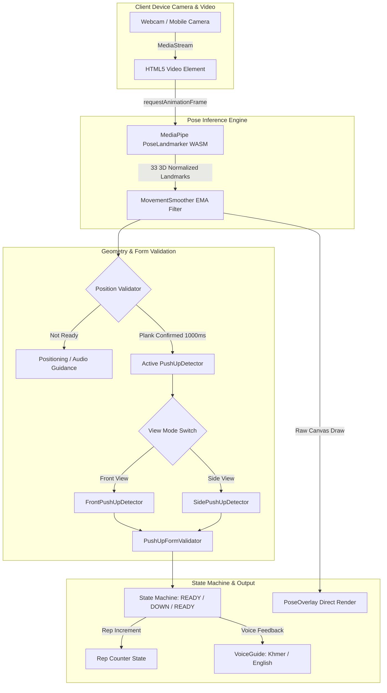
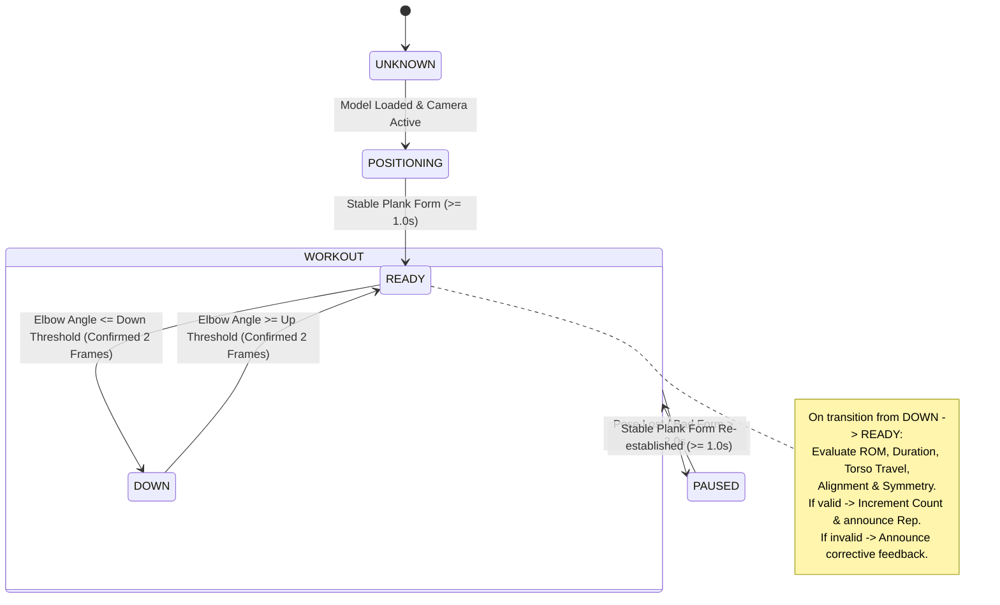

# Project Context & Features Specification

> **Project Name**: Push-Up Counter  
> **Version**: 0.1.0  
> **Repository Type**: Next.js (App Router) + TypeScript + MediaPipe WASM + Cloudflare Workers (OpenNext)  
> **Primary Runtime**: 100% Client-side in-browser WebAssembly & WebGL / Edge hosting on Cloudflare  

---

## 1. Executive Summary & Vision

**Push-Up Counter** is an AI-powered, browser-based fitness application designed to count push-up repetitions and evaluate physical exercise form in real time using consumer webcams or mobile cameras. 

### Key Design Tenets
1. **100% Local Processing & Absolute Privacy**: Video frames are processed entirely in memory on the user's device via client-side WebAssembly models. No video, images, or audio are ever transmitted to or stored on any server.
2. **Sub-millisecond Feedback Loop**: High-frequency video frame processing completely bypasses the React component lifecycle, rendering directly to an HTML5 Canvas overlay via `requestAnimationFrame` to sustain 30–60 FPS even on modest mobile hardware.
3. **Anti-Cheat & Strict Biomechanical Form Evaluation**: Unlike naive angle-threshold counters, this engine evaluates multi-point body geometry (elbow angles, torso vertical translation, arm symmetry, and head-to-heel spine alignment) to reject incomplete reps, arm-only twitching, sagging hips, and rapid bouncing.
4. **Dual Perspective Flexibility**: Full support for both **Front View** (bilateral arm tracking) and **Side View** (sagittal plane alignment tracking).
5. **Full Khmer & English Voice Coaching**: Rich audio feedback with browser `SpeechSynthesis` for English and pre-rendered native audio assets (`KhmerAudioManager`) with priority queuing for Khmer.

---

## 2. Technology Stack

| Layer / Domain | Technology | Details / Rationale |
|---|---|---|
| **Framework** | Next.js 16.2.11 (React 19.1.7) | App Router architecture, zero server-side rendering required for workout loop |
| **Language** | TypeScript 5.7.4 | Strict type safety across geometry, landmarks, state transitions, and i18n |
| **Styling** | Tailwind CSS v4 | Ultra-lean, dark-mode first, mobile viewport optimized (`100dvh`, safe area insets) |
| **Computer Vision / ML** | MediaPipe Tasks Vision (`@mediapipe/tasks-vision` 1.0.1) | Google MediaPipe Pose Landmarker model running on WebAssembly with GPU delegate and CPU fallback |
| **Hosting & Deployment** | Cloudflare Workers & OpenNext (`@opennextjs/cloudflare` 1.19.9, Wrangler 4.123) | Ultra-fast edge distribution of static and client bundle assets |
| **Testing Engine** | Vitest 4.1.10 | Fast unit tests simulating landmark coordinates across time steps |

---

## 3. High-Level Architecture & Data Flow



---

## 4. Key Features & Capabilities

### 4.1 Real-Time Body Tracking & Skeleton Overlay
- Uses the **MediaPipe Pose Landmarker** model (`pose_landmarker.task`, 33 normalized 3D landmarks).
- **GPU Acceleration**: Defaults to WebGL/GPU delegate, automatically falling back to CPU if WebGL is unavailable.
- **Direct Canvas Pipeline**: `PoseOverlay` bypasses React's virtual DOM to draw real-time joints and connections, calculating and rendering live elbow angles directly above the joints.
- **Mirroring Support**: Automatically aligns with front-facing camera mirroring (`scaleX(-1)`).
- **Landmark Smoothing**: Temporal Exponential Moving Average (`MovementSmoother`) reduces high-frequency jitter without introducing lag (`landmarkAlpha = 0.35`).

### 4.2 Multi-Perspective Support (Front & Side)
- **Front View Mode**:
  - Simultaneously tracks left and right elbow angles: $\text{Angle}(Shoulder, Elbow, Wrist)$.
  - Calculates bilateral arm movement asymmetry to detect one-armed dipping.
  - Measures vertical midpoint movement of both shoulders vs. torso length.
- **Side View Mode**:
  - Automatically identifies the most visible side (left vs. right) by summing landmark visibility confidences.
  - Tracks the primary elbow angle along the sagittal plane.
  - Evaluates full body alignment: $\text{Angle}(Shoulder, Hip, Ankle)$.

### 4.3 Anti-Cheat & Form Quality Scoring
The detector features two operational modes: **Standard** and **Strict**.

| Metric / Check | Standard Mode | Strict Mode | Purpose |
|---|---|---|---|
| **Side Top Elbow Angle** | $\ge 140^\circ$ | $\ge 150^\circ$ | Full arm lockout / extension |
| **Side Bottom Elbow Angle** | $\le 105^\circ$ | $\le 100^\circ$ | Sufficient push-up depth |
| **Front Top Elbow Angle** | $\ge 130^\circ$ | $\ge 135^\circ$ | Bilateral arm extension |
| **Front Bottom Elbow Angle** | $\le 100^\circ$ | $\le 95^\circ$ | Bilateral arm flexion |
| **Min Range of Motion (ROM)** | 0.50 (50%) | 0.60 (60%) | Rejects shallow chest dips |
| **Min Rep Duration** | $400\text{ ms}$ | $500\text{ ms}$ | Anti-bouncing / rapid false rep filter |
| **Max Rep Duration** | $9000\text{ ms}$ | $8000\text{ ms}$ | Stalled repetition timeout |
| **Min Shoulder Travel Ratio** | 0.08 of torso | 0.12 of torso | Rejects arm-only movement with stationary torso |
| **Max Arm Asymmetry** | 0.45 | 0.35 | Prevents uneven body tilting |
| **Max Alignment Deviation** | $45^\circ$ | $35^\circ$ | Detects sagging hips / excessive piking |
| **Min Form Score** | 60 / 100 | 70 / 100 | Holistic score required for repetition count |

### 4.4 Pre-Workout Positioning Guidance
A pre-flight validation module (`position-validator.ts`) validates the user's framing prior to counting:
- **Distance Guard**: Detects if the body is `TOO_CLOSE` ($>95\%$ frame) or `TOO_FAR` ($<35\%$ frame).
- **Viewport Bounds**: Directs the user to `MOVE_LEFT`, `MOVE_RIGHT`, `MOVE_UP`, or `MOVE_DOWN` if limbs exceed the bounding box margins.
- **Orientation Guide**: Directs the user to `TURN_SIDEWAYS` in side mode or `FACE_CAMERA` in front mode.
- **Posture Verification**: Prevents standing upright (`GET_IN_PUSHUP_POSITION`).
- **Auto-Readiness**: Requires 1.0 second of stable plank posture before switching from `POSITIONING` to `WORKOUT`.
- **Auto-Pause**: If form or visibility is lost for $>2.0$ seconds during a workout, the app pauses and provides guidance, auto-resuming once form is re-established.

### 4.5 Bilingual Voice Coaching (English & Khmer)
- **Dual Engine Architecture**:
  - **Khmer (km)**: Utilizes pre-recorded, natural human voice audio assets located in `public/audio/km/`. Audio is scheduled via `KhmerAudioManager` with a single shared `HTMLAudioElement` that is unlocked on the initial "Start Camera" user gesture to bypass iOS Safari and Android Chrome autoplay restrictions.
  - **English (en)**: Utilizes the browser's native `window.speechSynthesis` engine with rate and pitch normalization.
- **Priority Queue System**:
  - `CRITICAL`: Rep counts, "Ready", "Go", "Up", "Down", "Pose Lost" (cancels lower-priority speech).
  - `HIGH`: Major form issues ("Keep body straight", "Move whole body", "Rep not counted", "Too fast").
  - `MEDIUM`: Posture adjustments ("Move closer", "Turn sideways", "Go lower", "Hips too high").
  - `LOW`: "Perfect position", "Reset".
- **Spoken Rep Counting**: Announces completed reps in both English and Khmer.

### 4.6 Mobile-First Responsive User Experience
- Designed specifically for smartphone placement on the floor or lean stands.
- Dynamic camera switcher: toggle between front (selfie) and rear (environment) cameras with auto-detection of mirrored vs. non-mirrored coordinate transforms.
- High-visibility oversized rep counter with tactile scale-bump animation.
- Dynamic colored status badge (Green for good form/ready, Amber for warnings/down state, Red for rejected reps).
- Integrated developer debug overlay (`showDebug`) displaying real-time metrics, angles, ROM score, visibility %, and rejection reasons in development mode.

---

## 5. State Machine Specifications

### Push-Up Cycle State Machine


---

## 6. Repository File & Directory Structure

```text
pushup-counter/
├── .dev.vars                          # Local Cloudflare development environment variables
├── .gitignore                         # Git ignore rules
├── cloudflare-env.d.ts                # Wrangler generated Cloudflare environment typings
├── eslint.config.mjs                  # ESLint 9 configuration
├── next.config.ts                     # Next.js 16 configuration
├── open-next.config.ts                # OpenNext adapter settings for Cloudflare Workers
├── package.json                       # Dependencies, scripts, and package metadata
├── postcss.config.mjs                 # PostCSS configuration for Tailwind CSS v4
├── tsconfig.json                      # TypeScript configuration
├── wrangler.jsonc                     # Cloudflare Workers deployment configuration
│
├── public/                            # Static public assets
│   ├── _headers                       # Edge caching headers
│   ├── favicon.svg                    # Application favicon
│   ├── models/
│   │   └── pose_landmarker.task       # MediaPipe Pose Landmarker binary bundle
│   └── audio/
│       └── km/                        # Khmer localized MP3 voice audio files
│           ├── allow-camera.mp3
│           ├── arms-bend.mp3
│           ├── arms-straight.mp3
│           ├── bad-form.mp3
│           ├── body-not-detected.mp3
│           ├── body-straight.mp3
│           ├── camera-error.mp3
│           ├── camera-ready.mp3
│           ├── come-up.mp3
│           ├── down.mp3
│           ├── face-camera.mp3
│           ├── get-into-position.mp3
│           ├── go-lower.mp3
│           ├── good-form.mp3
│           ├── hips-too-high.mp3
│           ├── hips-too-low.mp3
│           ├── keep-going.mp3
│           ├── move-closer.mp3
│           ├── move-farther.mp3
│           ├── move-left.mp3
│           ├── move-right.mp3
│           ├── move-up.mp3
│           ├── move-down.mp3
│           ├── pose-lost.mp3
│           ├── pose-ready.mp3
│           ├── ready.mp3
│           ├── reset.mp3
│           ├── side-camera.mp3
│           ├── slow-down.mp3
│           ├── start.mp3
│           ├── too-fast.mp3
│           ├── up.mp3
│           ├── whole-body.mp3
│           └── numbers/               # Optional audio numbers (e.g. 1.mp3, 2.mp3)
│
└── src/
    ├── app/                           # Next.js App Router root
    │   ├── globals.css                # Global CSS & Tailwind imports
    │   ├── layout.tsx                 # Root layout with responsive metadata
    │   └── page.tsx                   # Main entry point mounting PushUpApp
    │
    ├── components/
    │   ├── camera/
    │   │   └── CameraView.tsx         # MediaStream acquisition, device switcher, mirror handling
    │   ├── pose/
    │   │   └── PoseOverlay.tsx        # High-performance HTML5 Canvas skeleton & angle renderer
    │   └── workout/
    │       ├── CameraModeSwitch.tsx   # Front View vs. Side View selector button
    │       ├── FormDebugOverlay.tsx   # Developer HUD showing live metrics and failure reasons
    │       ├── PositionGuide.tsx      # Viewfinder overlay, prompt bubbles, and status alerts
    │       ├── PushUpApp.tsx          # Main workout orchestrator and state coordinator
    │       ├── RepCounter.tsx         # Large numerical counter with bump animations
    │       ├── StartScreen.tsx        # Pre-workout launch screen with language and mode toggles
    │       ├── WorkoutControls.tsx    # Reset and Stop workout action buttons
    │       ├── WorkoutHeader.tsx      # Navigation header with settings, voice, and language controls
    │       └── WorkoutStatus.tsx      # Live pill badge displaying workout state & form feedback
    │
    └── lib/
        ├── i18n/
        │   ├── translations.ts        # English (en) and Khmer (km) localization dictionaries
        │   └── translations.test.ts   # Translations test suite
        ├── pose/
        │   ├── landmarks.ts           # MediaPipe 33 landmark enumeration & NormalizedLandmark type
        │   ├── pose-landmarker.ts     # MediaPipe singleton initializer (GPU delegate with CPU fallback)
        │   └── pose-utils.ts          # Geometric helpers (3-point angles, distance, midpoints)
        ├── voice/
        │   ├── khmer-audio.ts         # Khmer HTMLAudioElement manager, queue, and autoplay unblocker
        │   ├── voice-guide.ts         # Unified voice coaching controller (Khmer MP3s + English TTS)
        │   └── voice-guide.test.ts    # Voice prioritization and language test suite
        └── workout/
            ├── movement-smoother.ts   # Exponential moving average filter for coordinates & scalars
            ├── position-validator.ts  # Pre-workout user framing & orientation verification
            ├── position-validator.test.ts # Framing test suite (bounds, body size, upright checks)
            ├── pushup-detector.ts     # Unified detector facade dispatching to Front or Side engines
            ├── pushup-detector.test.ts# Strict & Standard unit tests (anti-cheat, ROM, duration)
            ├── pushup-form-validator.ts # Biomechanical scoring, ROM equations, and rejection criteria
            ├── pushup-front-detector.ts # Front-perspective detection engine (bilateral symmetry)
            └── pushup-side-detector.ts  # Side-perspective detection engine (body alignment)
```

---

## 7. Testing & Quality Verification

The test suite is built on **Vitest** and completely decouples geometric logic from browser camera streams by utilizing synthesized 33-point landmark arrays across realistic timestamp sequences.

### Test Coverage Highlights
- **Valid Push-Ups**: Verifies single and multi-rep cycles progressing from `READY` $\to$ `DOWN` $\to$ `READY`.
- **Anti-Cheat Validation**:
  - *Insufficient ROM*: Shallow push-ups ($120^\circ$) are rejected.
  - *Arm-Only Movement*: Elbow flexion with $0.00$ shoulder/torso translation is rejected.
  - *Rapid Bouncing*: Repetition duration $< 500\text{ ms}$ is rejected.
  - *Low Landmark Confidence*: Visibility dropping below $0.5$ triggers rejection.
  - *Body Alignment / Sagging Hips*: Extreme hip deviation from the shoulder-ankle vector is rejected.
  - *Arm Asymmetry (Front Mode)*: Dipping one arm while the other stays stationary is rejected.
- **Framing & Viewport Checks**:
  - Detects `NO_PERSON`, `TOO_CLOSE`, `TOO_FAR`, `MOVE_LEFT`, `MOVE_RIGHT`, `MOVE_UP`, `MOVE_DOWN`.
  - Detects upright standing in front of camera (`GET_IN_PUSHUP_POSITION`).
  - Verifies correct angle orientation (`TURN_SIDEWAYS` vs `FACE_CAMERA`).
- **Translation Integrity**: Verifies 100% parity of keys between English and Khmer dictionaries.

Execute tests with:
```bash
npm run test
```

---

## 8. Build, Run, and Deployment Instructions

### Prerequisites
- Node.js 18+ & npm 9+
- Modern browser supporting WebAssembly and `navigator.mediaDevices.getUserMedia`
- HTTPS environment (or `localhost`) for camera permissions

### Development Server
```bash
npm install
npm run dev
# Accessible at http://localhost:3000
```

### Production Build & Type Check
```bash
npm run build
npm run lint
```

### Cloudflare Deployment
The project uses OpenNext to compile Next.js 16 into a Cloudflare Workers bundle.
```bash
# Preview Cloudflare edge worker locally
npm run preview

# Deploy directly to Cloudflare Workers
npm run deploy
```
