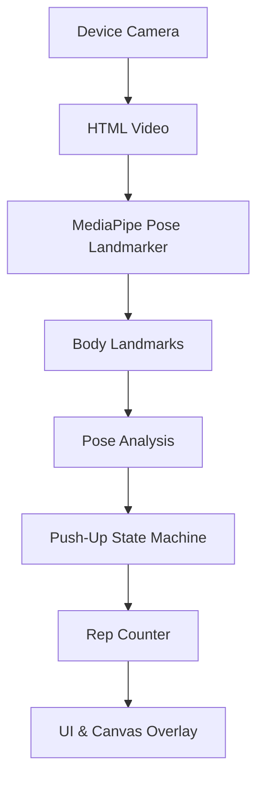
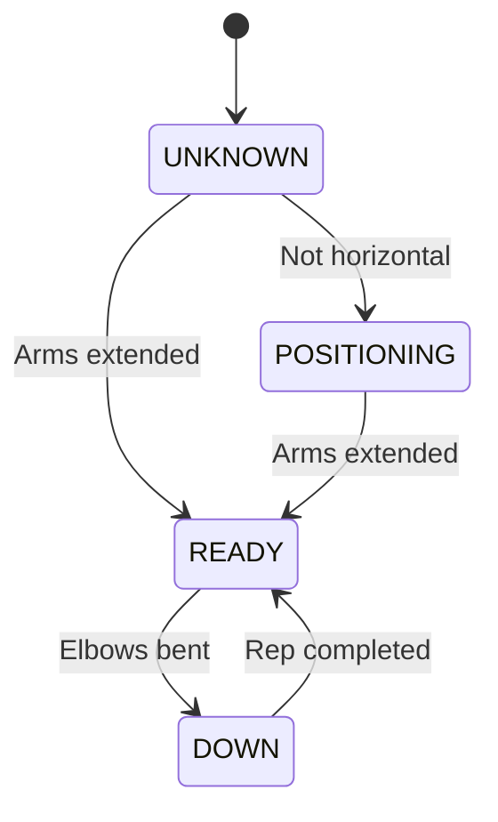

# Push-Up Counter

A real-time browser-based push-up counter that uses MediaPipe pose estimation to track body movement through the device camera. It dynamically renders a live skeleton overlay and counts completed repetitions entirely on the user's local device without requiring a backend.


## Features

- Real-time camera tracking (supports front and rear mobile cameras)
- Browser-side pose estimation via WebAssembly
- Real-time pose skeleton overlay perfectly aligned with mirrored video
- Push-up repetition counting
- Push-up movement state machine detection (Ready, Down, Positioning)
- Live elbow angle visualization 
- Camera permission handling and error recovery
- Responsive mobile-first UI with automatic dimension scaling
- Local video processing (Privacy-focused)
- Workout reset and camera start/stop functionality
- High-confidence landmark filtering

## Demo

Demo deployment will be added here.

## How It Works

The application orchestrates the device camera and MediaPipe models inside the browser. High-frequency video frames are processed asynchronously, bypassing React's rendering lifecycle to maintain high frame rates. 



## Pose Detection

The application uses `@mediapipe/tasks-vision` to load the **MediaPipe Pose Landmarker** model locally.

1. **Browser-side inference**: A WASM delegate executes the pose detection locally on the client's device (defaulting to GPU acceleration and falling back to CPU if unavailable).
2. **Body landmarks**: The model returns 33 3D normalized landmarks representing the human body.
3. **Canvas skeleton rendering**: A transparent HTML `<canvas>` exactly matches the video dimensions. It draws:
   - **Landmarks**: Small circular points at joint coordinates.
   - **Pose connections**: Thin lines connecting logical body parts using MediaPipe's topological constants.
4. **Visibility filtering**: The skeleton overlay dynamically excludes joints that drop below the `0.5` visibility confidence threshold.
5. **Real-time processing**: Pose data bypasses the React DOM, directly manipulating the Canvas context within a native `requestAnimationFrame` loop.

## Push-Up Detection

The push-up detection algorithm leverages a strict state machine to prevent false positives and validate repetitions.

Relevant landmarks used for calculation:
- Shoulders, Elbows, Wrists, Hips, Ankles.

### State Machine



### Detection Logic

The engine calculates the interior **elbow angle** (Shoulder → Elbow → Wrist) using the side of the body with the highest visibility confidence.

- **UP State (READY)**: Triggered when the elbow angle reaches `>= 150°`.
- **DOWN State**: Triggered when the elbow angle reaches `<= 90°`.
- **Rep Completion**: Moving from UP → DOWN → UP registers exactly 1 repetition.
- **Validation**:
  - `minVisibility`: 0.6 confidence required across critical joints.
  - `minRepDurationMs`: Repetitions faster than 300ms are ignored (debouncing).
  - `maxRepDurationMs`: Repetitions taking longer than 5000ms are ignored.

## Privacy

- **Camera frames are processed entirely locally on the user's device.**
- Video streams are never uploaded or transmitted to any server.
- No video storage or recording occurs.
- No server-side pose inference occurs.

## Technology Stack

| Technology | Purpose |
| --- | --- |
| Next.js | Web application framework (App Router) |
| TypeScript | Type-safe development |
| MediaPipe | Machine learning pose estimation |
| Tailwind CSS | Minimalist UI styling |
| Cloudflare Workers | Edge hosting and runtime execution |
| OpenNext | Next.js compilation for Cloudflare Workers |

## Requirements

- **Node.js** 18+
- **npm** (v9+)
- A modern browser (Chrome, Safari, Edge, Firefox)
- An active Camera/Webcam
- **HTTPS** is strictly required for camera access in production deployments. (Localhost bypasses this requirement during development).

## Installation

```bash
git clone <repository-url>
cd pushup-counter
npm install
```

## Environment Variables

No environment variables are required for the current MVP.

## Development

To start the local development server:

```bash
npm run dev
```

The application will be accessible at `http://localhost:3000`.

## Camera Testing

To verify the core loop functionality during development:

1. Open the application locally.
2. Click **Start Camera**.
3. Grant the browser camera permission.
4. Position your full body inside the camera view (ensure your arms and torso are visible).
5. Wait for the model to load and the green skeleton overlay to appear.
6. Verify your elbow angle appears accurately on the canvas.
7. Perform a push-up.
8. Observe the UI Status transition from `Ready` → `Down` → `Ready`.
9. Verify the repetition counter increments.

## Build

To compile the Next.js production build:

```bash
npm run build
```

This command generates an optimized static build and validates the entire TypeScript tree.

## Tests

The state machine is highly decoupled from the UI and is fully unit-testable using simulated landmark arrays. 

To run the test suite:

```bash
npm run test
```

The tests cover:
- Valid repetitions
- Incomplete repetitions
- Multiple concurrent repetitions
- Invalid false movements (e.g., dipping slightly but not breaking the 90° threshold)
- Repeated down state hysteresis

## Linting

To enforce code quality and stylistic conventions:

```bash
npm run lint
```

## Cloudflare Deployment

The project is natively configured for Cloudflare Workers using `@opennextjs/cloudflare`. 

To emulate the production Cloudflare edge runtime locally:

```bash
npm run preview
```

To deploy directly to your Cloudflare account:

```bash
npm run deploy
```

## Architecture

- `src/app/` — Next.js routing, layout, and global Tailwind stylesheets.
- `src/components/camera/` — Reusable device-agnostic video stream components.
- `src/components/pose/` — High-performance Canvas overlay orchestrators mapping WebAssembly data to screen pixels.
- `src/components/workout/` — The main orchestrator linking the camera, overlay, and rep counter state.
- `src/lib/pose/` — MediaPipe constants, singletons, and geometric utility math.
- `src/lib/workout/` — The decoupled Push-up State Machine.
- `public/models/` — Local binary assets for the MediaPipe inference models.

## Performance

The application achieves smooth framerates on consumer hardware using the following techniques:
- **Browser-side WASM inference**: Reduces network latency to zero.
- **`requestAnimationFrame` loop**: Locks canvas rendering to the native display refresh rate.
- **MediaPipe Instance Reuse**: The landmarker is loaded as a singleton.
- **React State Isolation**: The entire skeleton and mathematical algorithms execute outside React's lifecycle. `setState` is only invoked when a push-up officially completes or the status string changes.

## Mobile Support

The application is heavily optimized for mobile devices:
- Supports both iOS and Android.
- Automatically handles Portrait and Landscape viewport reflows.
- Supports native Camera Switching (Front/Rear lenses) when multiple devices are detected.
- The canvas coordinate matrix is natively responsive to CSS `object-fit: cover` aspect ratio stretching.

## Troubleshooting

### Camera does not start
- Ensure your browser explicitly granted camera permissions.
- Ensure the site is being served over **HTTPS** (or `localhost`).
- Verify no other native application is hoarding the webcam stream.

### Skeleton is not visible
- Step further back from the camera; the model may be dropping visibility confidence if major body parts are occluded.
- Ensure the room is sufficiently lit.

### Push-ups are not counted
- Your elbow angle must strictly break **90°** at the bottom and extend past **150°** at the top.
- Ensure both your shoulder and wrist are clearly visible so the geometry engine can calculate the angle.
- You must hold the movement for longer than 300ms (hyper-fast glitch movements are debounced).

## Limitations

- Accuracy degrades if the camera angle is severely top-down or bottom-up (a side profile or 45-degree angle works best).
- Threshold-based geometric detection is rigid; it cannot grade the "quality" of your core form, only the extension of your elbows.
- Poor lighting creates noisy landmark coordinate jitter.

## Roadmap

Planned future features:
- Squat detection
- Form scoring (e.g., identifying sagging hips)
- Workout session history
- Exercise analytics

## Contributing

1. Fork the repository.
2. Create a feature branch.
3. Make your changes.
4. Run `npm run lint`.
5. Run `npm run test`.
6. Run `npm run build`.
7. Submit a pull request.

## Code Quality

The codebase enforces strict TypeScript typing across all boundaries. MediaPipe DOM elements and event handlers are properly garbage collected. The mathematical state machine relies on pure functions and is strictly testable without a browser environment.

## License

No license has been specified yet.
